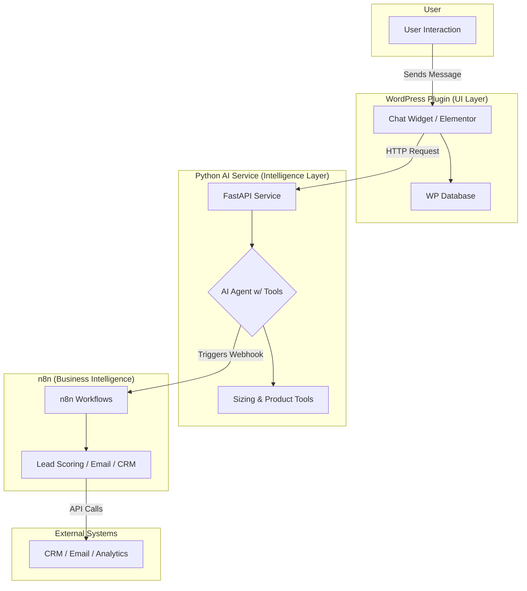

# Dehumidifier Assistant

This repository contains the full codebase for the Dehumidifier Assistant, a comprehensive business tool designed to qualify leads, provide accurate sizing calculations, and seamlessly hand off complex cases to human experts. The project is architected as a three-tier system, combining a WordPress plugin for the user interface, a Python AI service for intelligence, and n8n workflows for business automation.

## Core Architecture

The system is divided into three distinct layers:

-   **WordPress Plugin (`dehum-assistant-mvp`)**: Handles the frontend chat interface, Elementor integration, conversation logging, and the admin dashboard. This layer is responsible for all user interactions and data presentation.
-   **Python AI Service (`python-ai-service`)**: The intelligence layer of the application. It features a model-agnostic AI agent with tools for dehumidifier sizing, product lookups, and technical reference. This service is built with FastAPI and supports various AI models, including OpenAI, Claude, and Gemini, through LiteLLM.
-   **n8n Workflows**: The business intelligence layer that automates lead scoring, email workflows, and CRM integration. These workflows are triggered by the Python AI service to streamline business operations.

## Features

-   **AI-Powered Chat**: A responsive chat widget with AI-driven assistance.
-   **Professional Admin Interface**: Tools for viewing and managing conversation logs.
-   **Advanced Sizing Calculations**: Accurate dehumidifier sizing based on detailed room and environmental parameters.
-   **Product Recommendations**: Intelligent product matching from a predefined catalog.
-   **Session Management**: Persistent conversation history and context.
-   **Elementor Integration**: Easily place the chat widget anywhere on a WordPress site.
-   **Business Automation**: Automated lead scoring, email notifications, and CRM integration.

## Quick Start

### WordPress Plugin

1.  **Installation**:
    *   Navigate to the `dehum-assistant-mvp` directory.
    *   Zip the contents of the directory.
    *   Upload the zip file to your WordPress site via the plugin installer.
    *   Alternatively, you can manually copy the directory to `wp-content/plugins`.
2.  **Activation**:
    *   Activate the plugin from the WordPress admin dashboard.
    *   Configure the AI service URL and other settings in the plugin's admin page.

### Python AI Service

1.  **Environment Setup**:
    *   Navigate to the `python-ai-service` directory.
    *   Create and activate a virtual environment.
    *   Install the required dependencies: `pip install -r requirements.txt`.
2.  **Configuration**:
    *   Create a `.env` file from the `env.example` template.
    *   Add your OpenAI API key and any other necessary configurations.
3.  **Running the Service**:
    *   Start the service with `uvicorn main:app --host 0.0.0.0 --port 8000 --reload`.
    *   The service will be available at `http://localhost:8000`.

## Project Structure

The repository is organized into two main directories:

-   `dehum-assistant-mvp/`: Contains the WordPress plugin, including all PHP, CSS, and JS files.
-   `python-ai-service/`: Contains the FastAPI application, including the AI agent, tools, and configuration.

## Roadmap

For detailed information on the project's future development plans, please refer to the following documents:

-   [PROJECT_ROADMAP.md](PROJECT_ROADMAP.md)
-   [FUTURE_ROADMAP.md](FUTURE_ROADMAP.md)

These files outline the upcoming features, implementation priorities, and long-term vision for the project.

## License

This project is licensed under the MIT License. See the [LICENSE](LICENSE) file for details.
